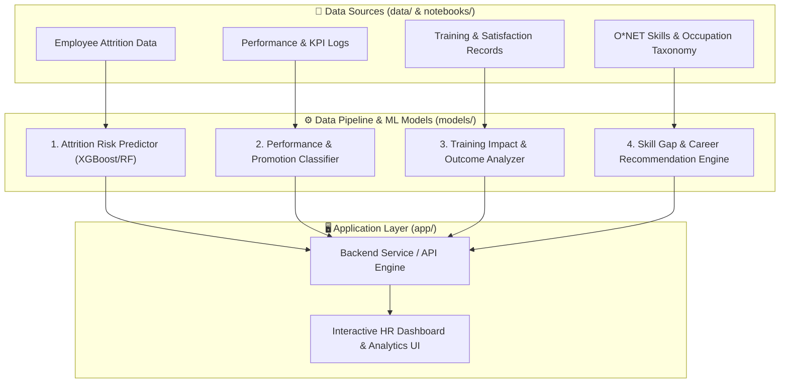
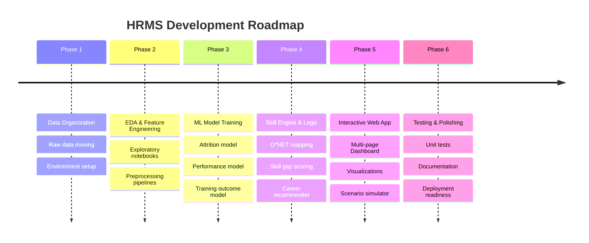

# 🚀 AI-Powered Human Resource Management System (HRMS) — Project Plan & Blueprint

---

## 📌 1. Project Overview: What Are We Building?

You are building an **AI-Powered HR Analytics & Decision Support System**. 

Modern HR departments struggle to proactively retain top talent, evaluate performance objectively, measure the impact of employee training programs, and identify skill gaps for career progression. This project solves those problems by turning standard HR data into an end-to-end intelligent platform with predictive machine learning models and an interactive web application.



---

## 📊 2. Dataset Breakdown: Understanding What You Have

Your `data/raw/` directory contains 7 rich datasets that power four distinct HR intelligence capabilities:

| Dataset File | Key Columns | Purpose in the System |
| :--- | :--- | :--- |
| `employee_attrition.csv` | `Age`, `MonthlyIncome`, `OverTime`, `YearsAtCompany`, `JobSatisfaction`, `Attrition` | **Attrition Prediction**: Train ML models to predict if an employee is at risk of leaving the company. |
| `Employee_Performance_Dataset.csv` | `KPI Score`, `Attendance (%)`, `Task Completion (%)`, `Manager Feedback`, `Promotion Eligibility` | **Performance & Promotion Modeling**: Predict promotion readiness and identify high-potential employees. |
| `employee_performance_pro.csv` | `OvertimeHoursPerMonth`, `LeavesTaken`, `CustomerSatisfaction`, `WorkLifeBalanceScore`, `AttritionRisk` | **Workplace Health & Risk Benchmarking**: Evaluate burnout risk, work-life balance impact, and multi-factor performance ratings. |
| `Cleaned_HR_Data_Analysis.csv` | `Engagement Score`, `Satisfaction Score`, `Training Program Name`, `Training Outcome`, `Training Cost` | **Training ROI & Employee Engagement**: Analyze training efficacy, training program costs, and satisfaction drivers. |
| `occupation_data.csv` | `O*NET-SOC Code`, `Title`, `Description` | **Occupational Framework**: Standardized job title descriptions across industries. |
| `essential_skills.csv` | `O*NET-SOC Code`, `Element Name`, `Importance`, `Data Value` | **Core Competency Mapping**: Required soft and hard skills with level/importance scores per role. |
| `software_skills.csv` | `O*NET-SOC Code`, `Workplace Example`, `Hot Technology`, `In Demand` | **Tech Stack & Tool Recommendations**: Identifies in-demand software and skills needed for each role. |

---

## 🧩 3. Core Modules of the System

### 🔍 Module 1: Employee Attrition & Churn Risk Predictor
* **Goal**: Identify employees at high risk of resignation before they leave.
* **Outputs**: Attrition probability (0–100%), key risk factors (SHAP / feature importances, e.g., low overtime pay, stagnant promotion), and retention recommendations.

### 📈 Module 2: Performance Evaluation & Promotion Readiness
* **Goal**: Objective, data-driven performance scoring and promotion suitability.
* **Outputs**: Performance tier classification (Exceeds, Meets, Needs Improvement), promotion eligibility prediction, and KPI benchmark comparisons.

### 🎓 Module 3: Training Impact & Learning ROI Analyzer
* **Goal**: Measure training effectiveness and optimize training budgets.
* **Outputs**: Training outcome predictor (Pass / Fail / Incomplete), correlation between training programs and performance increases, and cost-benefit analysis.

### 🧭 Module 4: O*NET Skill Gap & Career Pathway Recommender
* **Goal**: Guide employee career development and upskilling.
* **Outputs**: Given an employee's current role and desired future role, compute skill gaps against the O*NET taxonomy and recommend software tools/certifications.

### 💻 Module 5: Interactive HR Analytics Portal (Frontend)
* **Goal**: A user-friendly web portal for HR managers and business leaders.
* **Features**:
  * **Executive Overview**: High-level KPIs (headcount, retention rate, average performance, training spend).
  * **Individual Employee Profile**: Detailed 360° view with ML-predicted attrition and promotion likelihood.
  * **What-If Scenario Simulator**: Test salary hikes, overtime reductions, or training interventions to see impact on retention risk.
  * **Skill Matrix & Career Navigator**: Role transition roadmap and recommended upskilling paths.

---

## 📂 4. Target Project Architecture

Here is how your directory structure will evolve into a clean, modular, production-ready codebase:

```text
hrmsystem/
├── app/
│   ├── backend/               # Core business logic & API services
│   │   ├── __init__.py
│   │   ├── config.py          # Application configuration & paths
│   │   ├── data_loader.py     # Data access utilities
│   │   ├── predictor.py       # Model inference functions (Attrition, Performance, Training)
│   │   └── recommender.py     # Skill gap & career path matching engine
│   ├── frontend/              # Web application interface
│   │   ├── app.py             # Main entry point (Streamlit or Web Dashboard)
│   │   ├── pages/             # Multi-page dashboard
│   │   │   ├── 1_📊_Overview.py
│   │   │   ├── 2_⚠️_Attrition_Prediction.py
│   │   │   ├── 3_⭐_Performance_&_Promotion.py
│   │   │   ├── 4_🎓_Training_ROI.py
│   │   │   └── 5_🧭_Skills_&_Career_Paths.py
│   │   └── components/        # Reusable UI widgets & charts
│   ├── tests/                 # Unit & integration tests
│   │   ├── test_data_pipeline.py
│   │   └── test_models.py
│   └── requirements.txt       # Python dependencies
├── data/
│   ├── raw/                   # Raw CSV datasets
│   ├── processed/             # Cleaned, merged, and encoded data
│   └── external/              # O*NET reference taxonomy
├── models/                    # Saved trained model artifacts (.pkl / .joblib)
│   ├── attrition_model.joblib
│   ├── performance_model.joblib
│   ├── training_model.joblib
│   └── preprocessors/         # Scalers, encoders, and feature pipelines
├── notebooks/                 # Jupyter Notebooks for EDA & experimentation
│   ├── 01_eda_attrition.ipynb
│   ├── 02_eda_performance_and_training.ipynb
│   ├── 03_eda_skills_matching.ipynb
│   └── 04_model_training_experiments.ipynb
├── plan.md                    # Master project roadmap (this document)
└── README.md                  # Project documentation & setup guide
```

---

## 🛠️ 5. Step-by-Step Implementation Roadmap



### 📍 Step 1: Environment Setup & Data Structuring
1. Rename typo `app/requirenets.txt` to `app/requirements.txt` and populate core libraries (`pandas`, `numpy`, `scikit-learn`, `xgboost`, `streamlit`, `plotly`, `joblib`, `seaborn`, `matplotlib`).
2. Verify datasets in `data/raw/` (and optionally separate O*NET taxonomies to `data/external/`).
3. Set up empty EDA notebooks in `notebooks/`.

### 📍 Step 2: Exploratory Data Analysis (EDA) & Data Cleaning
1. Handle missing values, outliers, and correct data types across datasets.
2. Uncover key insights:
   * What features correlate most with attrition (OverTime, Low Salary, Years in Role)?
   * What drives high performance and promotion?
   * Which training programs yield the highest pass rates and satisfaction?
3. Save cleaned, standardized datasets into `data/processed/`.

### 📍 Step 3: Machine Learning Model Development
1. **Attrition Risk Classifier**:
   * Models: Logistic Regression, Random Forest, XGBoost / LightGBM.
   * Target metric: ROC-AUC and Recall (capturing at-risk employees is critical).
   * Explainability: Compute feature importances and SHAP values.
2. **Performance & Promotion Classifier**:
   * Predict `Promotion Eligibility` and multi-class `Performance Score`.
3. **Training Outcome Predictor**:
   * Predict probability of completing/passing training given employee profile.
4. Save best-performing models and preprocessing pipelines in `models/`.

### 📍 Step 4: O*NET Skill Matcher & Recommender Engine
1. Create a search and lookup service for O*NET occupations in `app/backend/recommender.py`.
2. Implement cosine similarity or gap analysis between current job skill requirements and target job requirements.
3. Recommend specific in-demand software tools and essential competencies to bridge the gap.

### 📍 Step 5: Web Application & Dashboard Development
1. Implement a **Streamlit** multi-page dashboard inside `app/frontend/`:
   * **Executive Dashboard**: Interactive KPI metrics, charts (Plotly).
   * **Attrition Risk Analyzer**: Upload/select an employee, view churn risk %, gauge charts, and primary risk factors.
   * **Promotion Readiness Portal**: Evaluate employees eligible for advancement.
   * **Training Impact Hub**: Explore training program effectiveness and costs.
   * **Career Path & Skills Explorer**: Select a role to view required competencies, hot technologies, and skill gap roadmaps.

### 📍 Step 6: Testing, Refinement & Delivery
1. Write automated test cases in `app/tests/` to verify data pipelines and model predictions.
2. Create comprehensive documentation in `README.md`.
3. Prepare a demo run configuration.

---

## 📦 6. Recommended Technology Stack

* **Language**: Python 3.10+
* **Data Processing**: `pandas`, `numpy`
* **Machine Learning**: `scikit-learn`, `xgboost`, `joblib`
* **Explainable AI**: `shap` (for explaining why someone might leave)
* **Visualizations**: `plotly`, `seaborn`, `matplotlib`
* **Frontend Web Framework**: `streamlit` (rapid, interactive, beautiful data dashboards)
* **Testing**: `pytest`

---

## ⚡ 7. Immediate Next Actions

To start building right away, we will proceed in this order:
1. **Fix `requirements.txt`** and install dependencies.
2. **Organize datasets** into `data/raw/` and `data/external/`.
3. **Build the EDA notebooks & data preprocessing pipelines**.
4. **Train the ML models** and save them to `models/`.
5. **Build the interactive Streamlit dashboard** in `app/frontend/`.
